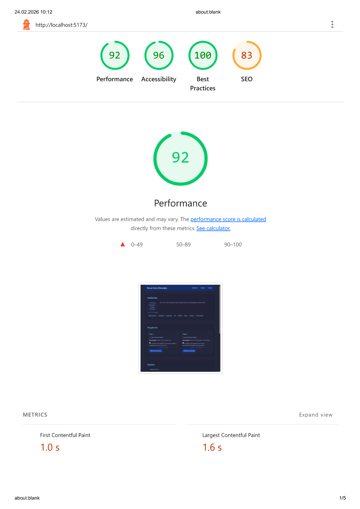
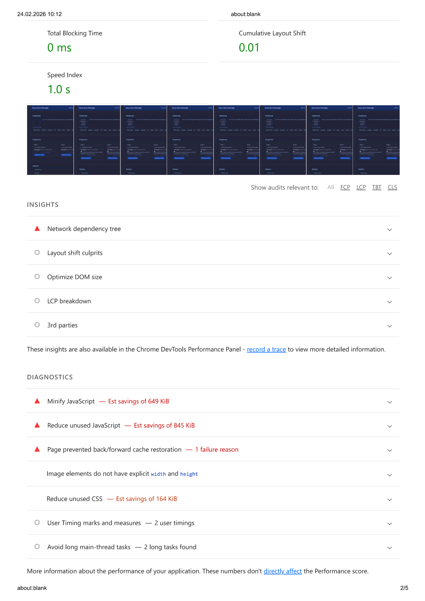
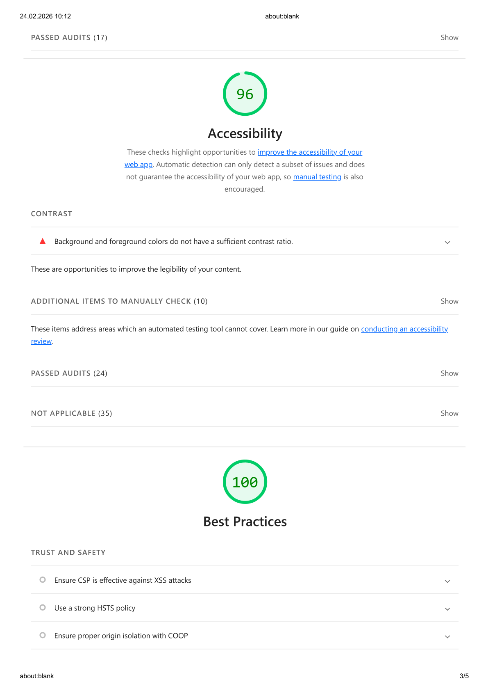
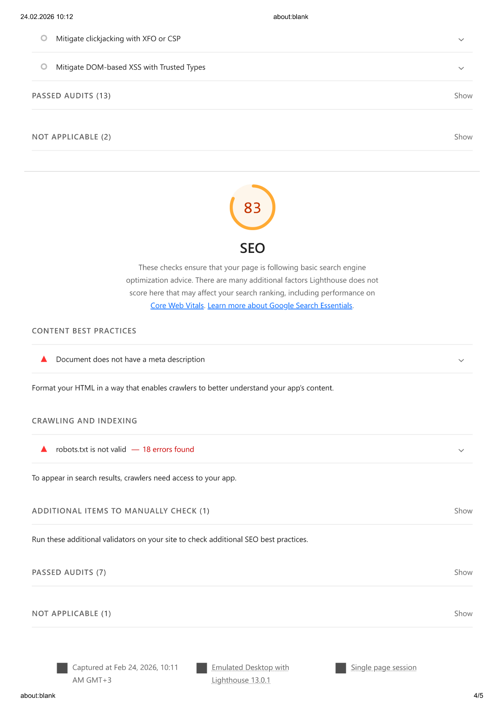
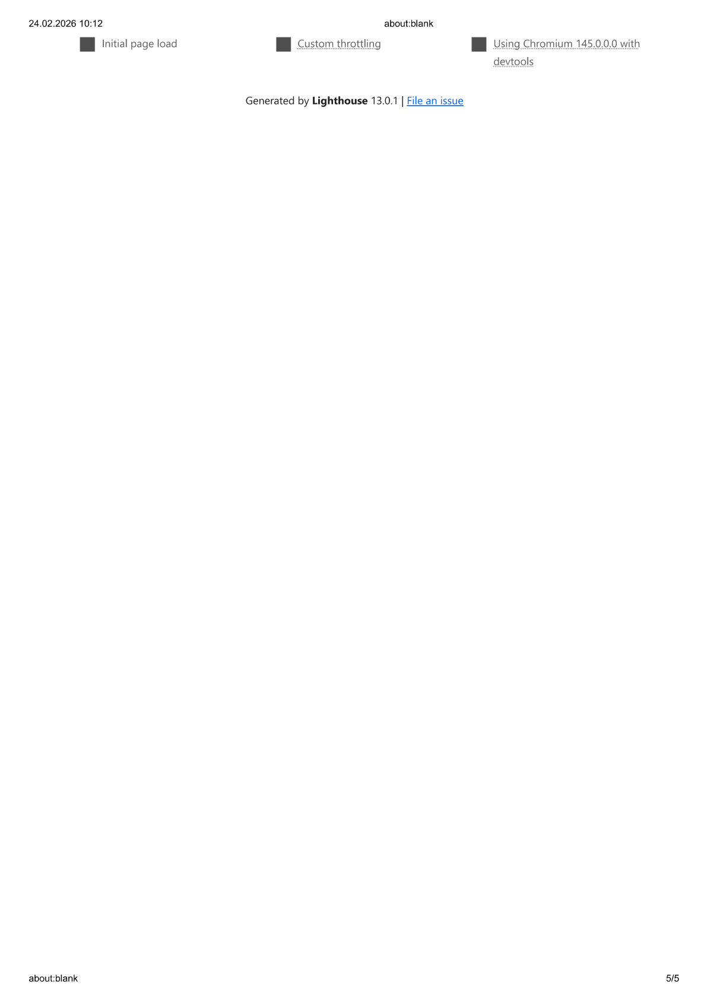

# Web Lab — Semantik Portfolyo

Yunus Emre Köseoğlu tarafından Web Programlama dersi kapsamında hazırlanmış,
semantik HTML ve erişilebilirlik standartlarına (WCAG 2.1) uygun kişisel portfolyo sitesi.

## Teknolojiler

- React 18 + Vite
- Semantik HTML5 (`header`, `main`, `section`, `article`, `footer`)
- Erişilebilirlik: `aria-label`, `aria-labelledby`, `aria-invalid`, `aria-required`, skip-link
- Client-side form doğrulama (React state tabanlı)

## Kurulum ve Çalıştırma

```bash
npm install
npm run dev
```

## Lighthouse Raporu

Projenin erişilebilirlik ve performans analizi için Lighthouse raporu:

📄 [Lighthouse.pdf](./Lighthouse.pdf)

> Rapor; **Performance**, **Accessibility**, **Best Practices** ve **SEO** kategorilerini kapsamaktadır.

### Rapor Görüntüleri

| | |
|---|---|
|  |  |
|  |  |



